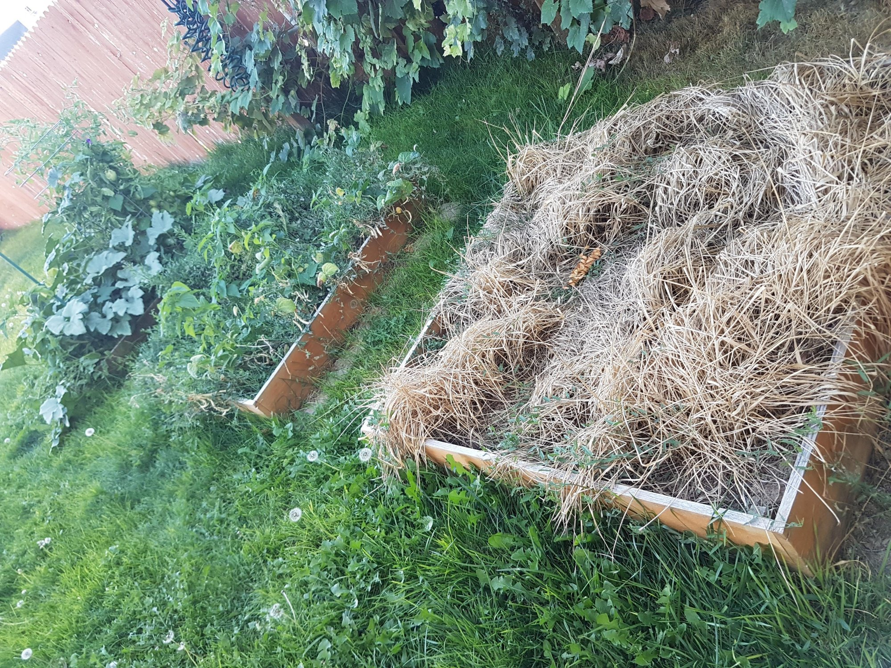

## Influencing Tech Culture
#### Robert Whiting

note:
* why I'm not qualified
  * not a professional speaker
  * no psychology, sociology, or managment degree
* why I am
  * worked at company with 
    * 3 people - tiny companies have a culture
    * 3,000 people - possible to change culture
    * 300,000 people - positive even when big
    * now 700 people - I can change it
  * change that worked, and that didn't

---

## outline
* culture
* elements
* steps
* pitfalls
* resources

---

## what is culture

----

> Culture is the set of stories we tell ourselves about our tribe.

note:
* patterns of behavior
* attitudes toward one another
* perceptions
* Story: Harry Potter's identity
* "You're a wizard Harry"

----

<!-- .element height="500px" .element style="border: 0; background: None; box-shadow: None" -->

note:
* under the stairs, but he was a famous wizard

----

<!-- .element height="500px" .element style="border: 0; background: None; box-shadow: None" -->

note:
changed his story over time

---

# culture

----

### startup

<!-- .element height="500px" .element style="border: 0; background: None; box-shadow: None" -->
note:
* new group with the right people
* unified vision
* examples: new startup, friend group
* con: can't scale unless you move to another method
* Story: Relidy startup, did whatever we wanted. 

----

### dictated

<!-- .element height="500px" .element style="border: 0; background: None; box-shadow: None" -->

note:
* clear vision
* disciplined consistency
* examples: military, classroom
* con: very difficult to change/learn/experiment
* Story: boarding school room cleanliness

----

### cultivated

<!-- .element height="500px" .element style="border: 0; background: None; box-shadow: None" -->

note:
* from existing
* check for clear direction
* examples: everywhere
* con: ownership is difficult, pruning the right things is hard

In the end, all culture is grown and cultivated by **those who value it**. A healthy culture comes from intentional cultivation.

----

## 3 gardens

----

<!-- .element height="500px" .element style="border: 0; background: None; box-shadow: None" -->

note:
* good intentions
* not kept up

----

<!-- .element height="500px" .element style="border: 0; background: None; box-shadow: None" -->

----

<!-- .element height="500px" .element style="border: 0; background: None; box-shadow: None" -->

note:
* efficient
* little to no beauty / human element

----

<!-- .element height="500px" .element style="border: 0; background: None; box-shadow: None" -->

----

<!-- .element height="500px" .element style="border: 0; background: None; box-shadow: None" -->

note:
* beautiful
* grown over time
* productive
* enjoyable
* fulfilling

> if you just spend 2 hours a day in your garden, it'll look like the magazines.

---

# elements

note:
* how do you cultivate a culture?
* 4Cs

----

### care
note: 
* Why are you doing this?

----

### consensus
note:
* You cannot change culture alone.

----

### communication
note: 
* More often than you are comfortable with
* Story: Indonesian burger, need for clear, complete communication

----

<!-- .element height="500px" .element style="border: 0; background: None; box-shadow: None" -->

----

### consistency
note:
* Until it sticks
* Until people are sick of hearing it

---

# steps
### labs

----

### choose an initiative
note:
* care
* pick a story that matters to you
* what story are you changing in the culture?

----

### validate 
note:
* consensus
* ask people
* is it worth the cost?
  * someone has to implement it and maintain it, is that you?
* is it inline with the company direction?

----

### gather a team
note:
* consensus
* you cannot do this alone
* you need other voices to make a story

----

### communicate
note:
* communicate
* be willing to stick it out
* tell your team, your lunch group, anyone who will listen

----

### execute 
note:
* consistency
* small steps

----

### iterate 
note:
* iterate: learn & repeat
* every 6 months
* be patient

---

# steps
### code reviews

----

### choose an initiative
note:
* care
* pick a story that matters to you
* what story are you changing in the culture?

----

### validate 
note:
* consensus
* ask people
* is it worth the cost?
  * someone has to implement it and maintain it, is that you?
* is it inline with the company direction?

----

### gather a team
note:
* consensus
* you cannot do this alone
* you need other voices to make a story

----

### communicate
note:
* communicate
* be willing to stick it out
* tell your team, your lunch group, anyone who will listen

----

### execute 
note:
* consistency
* small steps

----

### iterate 
note:
* iterate: learn & repeat
* every month!
* be patient

---

# pitfalls

----

### impatience
note:
* Linux group
* expected immediate adoption, support, excitement

----

### misalignment 
note:
* don't clash with management
* get your work done
* be the example you want others to emulate
* timing

----

<!-- .element height="500px" .element style="border: 0; background: None; box-shadow: None" -->

---

# resources

----

### Zappos

<!-- .element height="500px" .element style="border: 0; background: None; box-shadow: None" -->
note: example of cultural impact on work environment

----

### Google

<!-- .element height="500px" .element style="border: 0; background: None; box-shadow: None" -->
note: how Google shaped thier culture purposefully

----

### Pixar

<!-- .element height="500px" .element style="border: 0; background: None; box-shadow: None" -->
note: how Pixar shaped their culture to maintain the creative edge while being profitable

----

## go do it
* cultivate a new story
* elements
* steps
* resources

note:
* cultivate a new story
* elements: care, consensus, communication, consistency
* steps: choose, validate, gather, communicate, execute
* resources: read how others succeeded

---

# Q&A

